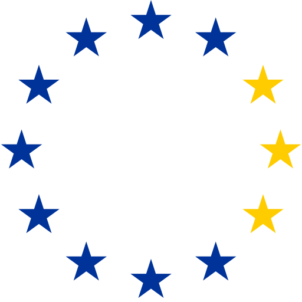

<div align="center">



# conformi-search — Serveur MCP de recherche juridique européenne

**Du droit de l'UE vérifiable pour les agents IA — chaque réponse porte un numéro CELEX et un lien EUR-Lex direct.**

**Langue :** [English](../../README.md) · [Deutsch](../de-DE/README.md) · [**Français**](README.md)

[](https://smithery.ai/server/conformi-eu/conformi-search)
[](https://conformi.eu/api/mcp)
[](https://www.wikidata.org/wiki/Q140166658)
[](../../LICENSE)


</div>

---

Serveur MCP de **recherche juridique européenne avec citations CELEX vérifiables** issues du corpus
EUR-Lex (allemand, anglais, français — chacun un **index en langue native, et non des traductions
automatiques**). Il expose des outils de recherche juridique de l'UE à tout client MCP et peut
utiliser, en option, une clé API conformi pour la recherche sémantique étendue.

> Outil de recherche avec citations de sources primaires — **pas de conseil juridique**, aucune relation avocat-client.

## Pourquoi cet outil existe

Les LLM répondent aux questions de droit européen de façon plausible mais invérifiable.
conformi-search renvoie des réponses **vérifiables par rapport à la source primaire** : chaque
résultat porte le numéro CELEX et un lien EUR-Lex direct, pour qu'un agent (ou un humain) puisse
vérifier la citation au lieu de faire confiance à une hallucination. Fonctionne dans Claude Code,
Claude Desktop, Cursor et tout autre harnais compatible MCP.

## Deux façons de l'utiliser

**1. En local (stdio)** — serveur MCP installable, sans clé pour les outils gratuits :

```bash
npm install && npm run build
node dist/index.js
```

Ou avec Docker :

```bash
docker build -t conformi-search-mcp .
docker run -i conformi-search-mcp
```

Ajouter à un client MCP (par ex. Claude Desktop) :

```json
{
  "mcpServers": {
    "conformi-search": {
      "command": "node",
      "args": ["/chemin/vers/conformi-search-mcp/dist/index.js"],
      "env": { "CONFORMI_API_KEY": "cfm_live_…  (optionnel, active search_eu_law)" }
    }
  }
}
```

Sans `CONFORMI_API_KEY`, les deux outils gratuits sont disponibles. Avec la clé s'ajoute
`search_eu_law`, facturé à la requête.

**2. Utiliser le point d'accès distant hébergé** directement (Streamable HTTP, sans état) :

```
https://conformi.eu/api/mcp
```

Enregistré dans le registre MCP officiel sous **`eu.conformi/conformi-search`**.
Wikidata : [Q140166658](https://www.wikidata.org/wiki/Q140166658)

## Outils

| Outil | Auth | Facturation |
|---|---|---|
| `search_eu_law` — recherche sémantique dans le droit dérivé de l'UE, résultats avec numéros CELEX + liens EUR-Lex ; filtre temporel `valid_at` optionnel | clé API | facturé à la requête |
| `get_knowledge_article` — rapport curé pour un acte juridique (RGPD, AI Act, NIS2, DORA, CRA …) avec métadonnées d'état juridique | aucune | gratuit |
| `get_legal_timeline` — chronologie d'applicabilité des actes majeurs (par ex. échéances haut risque de l'AI Act) | aucune | gratuit |

## Obtenir une clé API (lisible par machine)

Le contrat complet, prix et processus d'achat automatisé inclus, figure dans le document OpenAPI :

```
https://conformi.eu/api/v1/openapi.json
```

Essai gratuit de 7 jours (plan Professional), 0 € aujourd'hui, résiliable à tout moment avant la fin de l'essai.

## Test rapide (sans clé)

```bash
curl -X POST https://conformi.eu/api/mcp \
  -H "Content-Type: application/json" \
  -d '{"jsonrpc":"2.0","id":1,"method":"tools/call","params":{"name":"get_knowledge_article","arguments":{"celex":"32024R1689"}}}'
```

## Dépannage

| Symptôme | Cause et solution |
|---|---|
| `search_eu_law` renvoie `isError` avec une indication d'achat | Aucune clé `Authorization: Bearer` envoyée. Les outils gratuits fonctionnent sans clé ; la recherche est facturée — clé via https://conformi.eu/api/v1/openapi.json |
| `401 UNAUTHORIZED` sur la recherche | Clé invalide ou révoquée. Vérifiez la clé dans votre compte conformi.eu (Compte → Clés API) |
| `403 PLAN_REQUIRED` / `TRIAL_LIMIT_REACHED` | Abonnement inactif ou quota d'essai de 50 requêtes épuisé — activez l'abonnement |
| `404` pour un CELEX dans `get_knowledge_article` | Aucun rapport curé n'existe encore pour cet acte. Utilisez `search_eu_law` — l'ensemble du corpus est consultable |
| La connexion échoue | Le serveur ne parle que Streamable HTTP (pas de SSE). POST JSON-RPC vers https://conformi.eu/api/mcp ; GET renvoie 405 par conception |
| Autre | Ouvrez un ticket : https://github.com/conformi-eu/conformi-search-mcp/issues ou écrivez à info@conformi.eu |

## Licence

Ce dépôt documente le point d'accès public. Le service hébergé, son code source et ses produits de
données sont propriétaires et régis par les conditions de conformi.eu — seul le contenu de ce dépôt
est sous licence MIT.

## À propos

Réalisé par [conformi.eu](https://conformi.eu) — recherche de conformité UE avec sources vérifiables.
